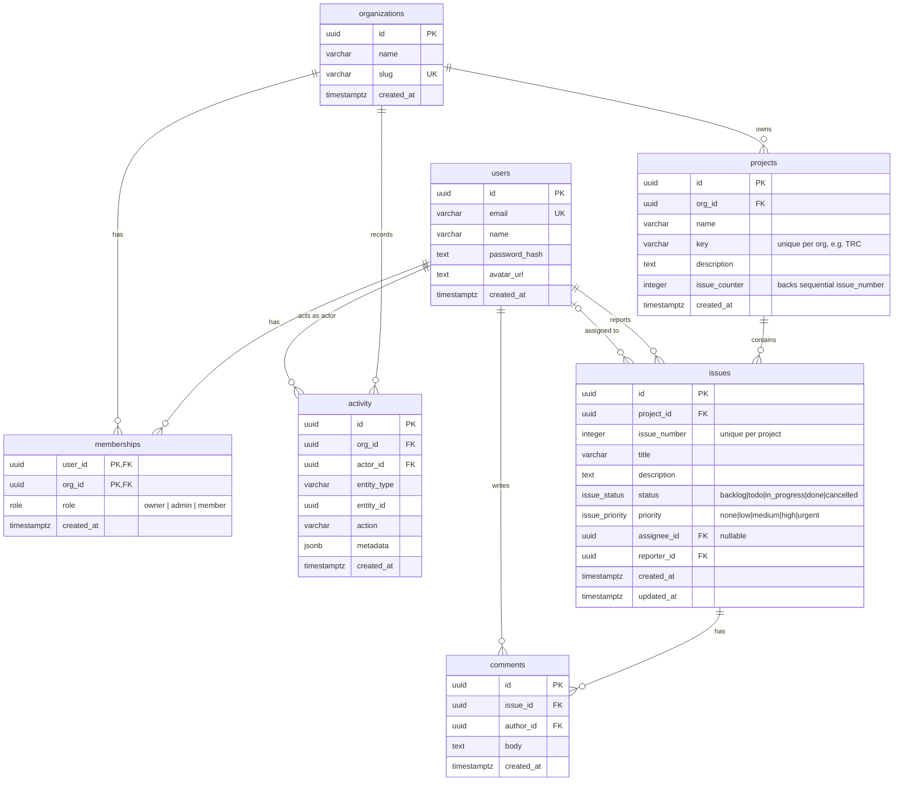

# Tracer

> **⚠️ Work in progress.** Building in stages — see commit history.

**Tracer** is a multi-tenant issue tracker in the spirit of Linear / Jira: organizations,
projects, and issues on a drag-and-drop Kanban board, with role-based access control and an
activity feed. It's a portfolio project demonstrating relational data modeling, RBAC,
optimistic UI, and clean full-stack architecture.

## Stack

| Layer     | Technology                                                                     |
| --------- | ------------------------------------------------------------------------------ |
| Frontend  | Next.js 14 (App Router), TypeScript, Tailwind CSS, Zustand, TanStack Query, RHF + Zod |
| Backend   | Node.js, Express 5, TypeScript, Zod, JWT (HTTP-only cookie), bcrypt             |
| Database  | PostgreSQL via **Drizzle ORM** + migrations                                    |
| Infra     | Docker Compose (Postgres + both apps)                                          |

## Repository layout

```
tracer/
├── frontend/     # Next.js app   — see frontend/CLAUDE.md
├── backend/      # Express API   — see backend/CLAUDE.md
├── README.md
└── .gitignore
```

A single Git repository holds both apps. Each is its own npm project with its own
`package.json`; they communicate only over HTTP.

## Getting started

```bash
# 1. Backend
cd backend
cp .env.example .env
npm install
npm run dev            # http://localhost:4000  (GET /health -> {"status":"ok"})

# 2. Frontend
cd ../frontend
cp .env.example .env.local
npm install
npm run dev            # http://localhost:3000
```

> Postgres, migrations, seed data, and a full Docker Compose setup arrive in later stages.

## Domain model

`users`, `organizations`, `memberships` (RBAC: owner / admin / member), `projects`, `issues`
(per-project sequential number like `TRC-14`), `comments`, and `activity`.



**Key relationships & rules**

- **Multi-tenancy:** everything hangs off `organizations`. A `user` joins an org through a
  `membership`, which carries their `role`. RBAC (`owner` > `admin` > `member`) is enforced in
  backend middleware.
- **Issues** belong to a `project` (which belongs to an org). `reporter_id` is required;
  `assignee_id` is nullable and set to `NULL` if the user is removed. `issue_number` is unique
  per project and generated via the project's `issue_counter` under a row lock to stay correct
  under concurrent inserts.
- **Cascades:** deleting an org removes its memberships, projects (and their issues, comments)
  and activity. Deleting an issue removes its comments.
- **`activity`** is an append-only audit log powering the feed; `metadata` (jsonb) holds
  action-specific detail such as `{ from: "todo", to: "in_progress" }`.

Indexes: `issues.project_id`, `issues.assignee_id`, `memberships.org_id`, `projects.org_id`,
`activity.org_id`, plus unique indexes on `(project_id, issue_number)` and `(org_id, key)`.

## Roadmap

- [x] Stage 0 — Scaffold & tooling
- [x] Stage 1 — Database & schema
- [ ] Stage 2 — Auth (JWT cookie, RBAC middleware)
- [ ] Stage 3 — Core API (orgs, projects, issues, comments, activity)
- [ ] Stage 4 — Frontend foundation (auth pages, app shell)
- [ ] Stage 5 — The board (Kanban + drag-and-drop + optimistic updates)
- [ ] Stage 6 — Issue detail & comments
- [ ] Stage 7 — Activity feed & members/settings
- [ ] Stage 8 — Polish, docs, deploy-readiness
