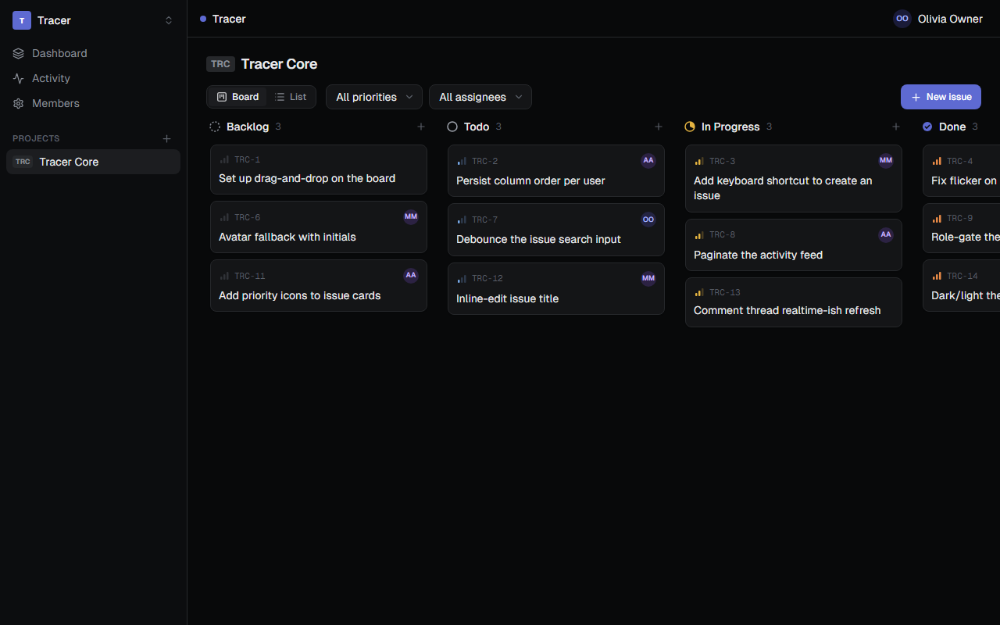
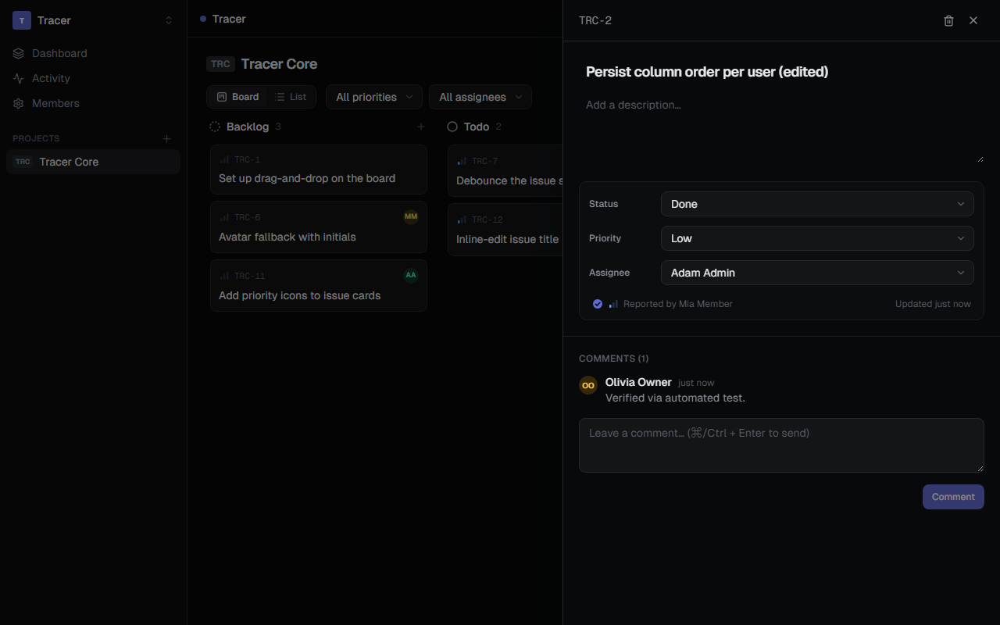
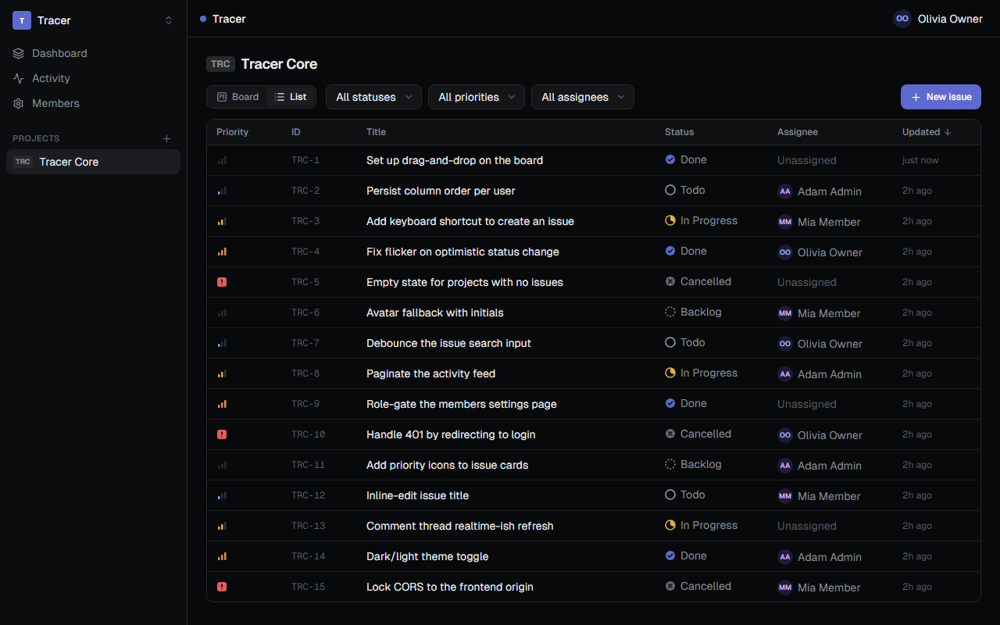
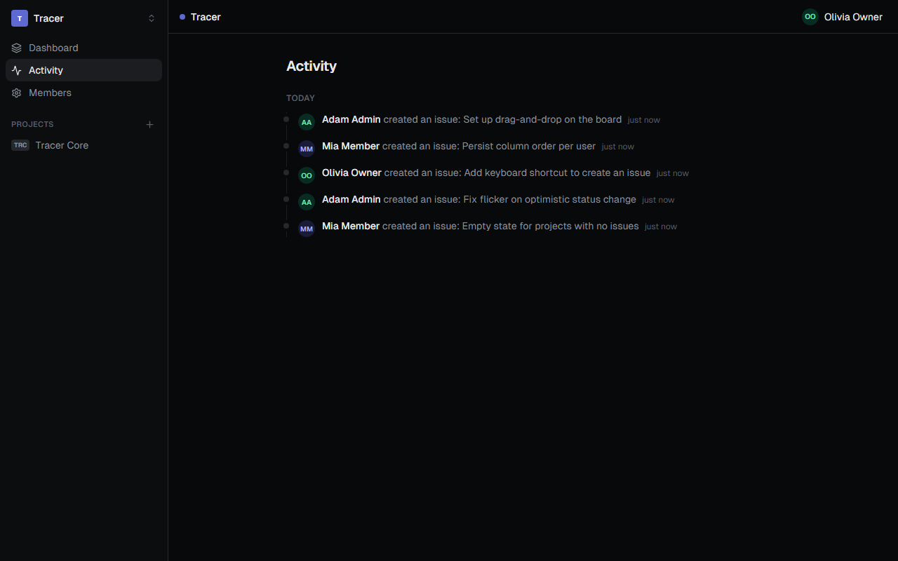
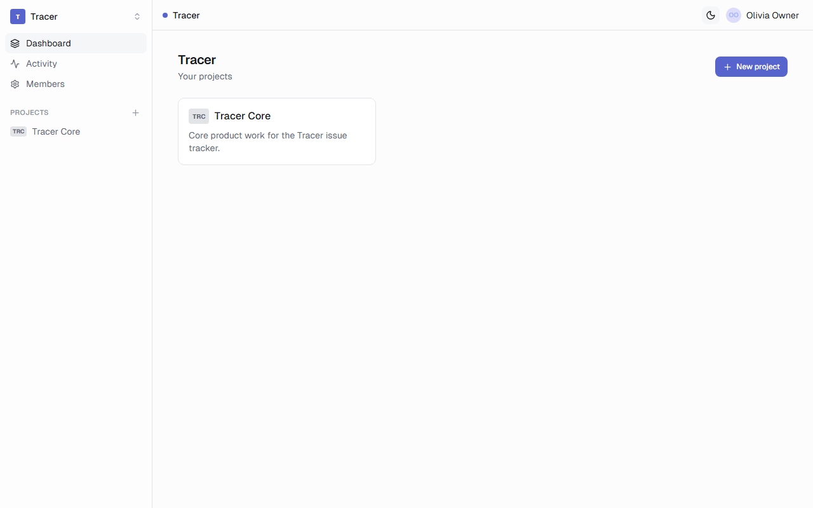
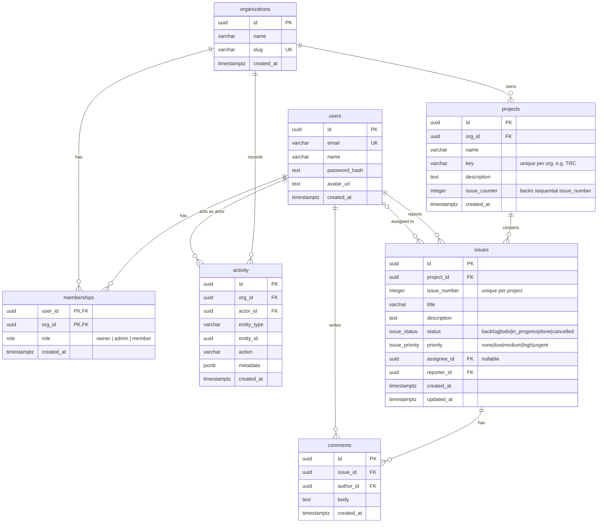

# Tracer

[](https://github.com/Jitenmohanty/Jira_Lite/actions/workflows/ci.yml)

**Tracer** is a multi-tenant issue tracker in the spirit of Linear / Jira: organizations,
projects, and issues on a drag-and-drop Kanban board, with role-based access control and an
activity feed. It's a portfolio project demonstrating relational data modeling, RBAC,
optimistic UI, and clean full-stack architecture.



<table>
  <tr>
    <td width="50%"></td>
    <td width="50%"></td>
  </tr>
  <tr>
    <td width="50%"></td>
    <td width="50%"></td>
  </tr>
</table>

## Features

- **Kanban board** with smooth **drag-and-drop** between status columns and **optimistic
  updates** (the card moves instantly; the change reconciles with the server and rolls back on
  failure).
- **List view** with sortable columns, plus **filters** (status / priority / assignee).
- **Issue detail** panel with inline title/description editing, optimistic status / priority /
  assignee changes, and a comment thread. Keyboard shortcuts (`C` to create, `Esc` to close).
- **Multi-tenant** organizations with **RBAC** (`owner` > `admin` > `member`) enforced in
  backend middleware and mirrored in the UI.
- Per-project sequential issue identifiers (e.g. `TRC-14`) that stay **correct under concurrent
  inserts**.
- **Activity feed** of every mutation, grouped by day.
- **Command palette** (`⌘/Ctrl+K`) for fast navigation and actions.
- **Notifications** — in-app bell (unread badge) **and** email when you're assigned an issue.
- **Auth**: email/password **and Google OAuth2**, email verification, and password reset — all
  with secure, hashed, expiring tokens and a JWT stored in an HTTP-only cookie.
- **Background jobs** on **BullMQ + Redis** (transactional email, notifications) and
  **scheduled cron jobs** (daily activity digest, expired-token cleanup).
- **Hardened**: Helmet headers, Redis-backed rate limiting on auth, structured logging (pino).
- Dark-mode-first design with a light theme, responsive down to mobile.

## Stack

| Layer      | Technology                                                                     |
| ---------- | ------------------------------------------------------------------------------ |
| Frontend   | Next.js 14 (App Router), TypeScript, Tailwind CSS, Zustand, TanStack Query, RHF + Zod, dnd-kit |
| Backend    | Node.js, Express 5, TypeScript, Zod                                            |
| Auth       | JWT (HTTP-only cookie) + Google OAuth2, bcrypt, tokenized email verify / reset |
| Data       | PostgreSQL via **Drizzle ORM** + migrations                                    |
| Async      | **Redis + BullMQ** queues & workers, repeatable (cron) jobs, Nodemailer email  |
| Hardening  | Helmet, Redis-backed rate limiting, pino structured logging                    |
| Infra      | Docker Compose (Postgres + Redis + API + worker + web)                         |

## Repository layout

```
tracer/
├── frontend/     # Next.js app   — see frontend/CLAUDE.md
├── backend/      # Express API   — see backend/CLAUDE.md
├── docker-compose.yml
├── docs/screenshots/
└── README.md
```

A single Git repository holds both apps. Each is its own npm project with its own
`package.json`; they communicate only over HTTP.

## Quick start (Docker)

One command brings up Postgres, the API, and the web app:

```bash
docker compose up --build
# web → http://localhost:3000 · api → http://localhost:4000
# brings up Postgres, Redis, the API, the queue worker, and the web app.
# load demo data (once containers are up):
docker compose exec backend npm run db:seed
```

**Demo logins** (all password `password123`): `owner@tracer.dev`, `admin@tracer.dev`,
`member@tracer.dev`.

## Manual dev setup

```bash
# Postgres + Redis (or bring your own and set DATABASE_URL / REDIS_URL)
docker run -d --name tracer-postgres -e POSTGRES_USER=tracer -e POSTGRES_PASSWORD=tracer \
  -e POSTGRES_DB=tracer -p 5432:5432 postgres:16-alpine
docker run -d --name tracer-redis -p 6379:6379 redis:7-alpine

# Backend API + queue worker (two terminals)
cd backend && cp .env.example .env && npm install
npm run db:migrate && npm run db:seed
npm run dev            # API  → http://localhost:4000  (GET /health -> {"status":"ok"})
npm run worker         # queue worker (email, notifications, cron)

# Frontend (new terminal)
cd frontend && cp .env.example .env.local && npm install
npm run dev            # http://localhost:3000
```

> **Email in dev:** without SMTP configured, messages are rendered and logged (no delivery) so
> the queue → worker → template pipeline works offline. Set `SMTP_*` (e.g. a Gmail app password)
> for real delivery. **Google sign-in** is optional — set `GOOGLE_CLIENT_ID/SECRET` to enable it.

## Architecture

- **Two independent apps, HTTP only.** No shared code crosses the boundary; the frontend holds
  hand-maintained TypeScript types mirroring the API responses.
- **Auth**: `POST /auth/login` sets a JWT in an **HTTP-only cookie** (XSS-resistant); the
  frontend never sees the token and sends every request with `credentials: 'include'`.
  **Google OAuth2** (authorization-code flow with a signed state cookie for CSRF) links accounts
  by email. **Email verification** and **password reset** use single-use, SHA-256-hashed,
  expiring tokens delivered by email.
- **RBAC** lives in the `memberships` table and is enforced by a `requireRole(minRole)`
  middleware that resolves the target org (directly, or via a project/issue) and checks the
  `owner > admin > member` hierarchy. The UI hides actions a role can't perform, but the backend
  is the source of truth.
- **Background processing**: an API request never blocks on slow work. Emails and notifications
  are enqueued to **BullMQ (Redis)** and handled by a separate **worker** process; **repeatable
  jobs** run the daily activity digest and token cleanup. Nodemailer sends via SMTP (Gmail-ready)
  or a dev preview transport.
- **Backend structure**: feature modules (`auth`, `orgs`, `projects`, `issues`, `comments`,
  `activity`, `notifications`), each with `schemas` (Zod) / `service` / `routes`; queues and
  workers under `queues/` and `workers/`; a central error handler returns a consistent
  `{ error: { code, message, details? } }` envelope.
- **Frontend state**: **TanStack Query** owns server state (caching, optimistic mutations);
  **Zustand** owns UI state (active org, board/list view, drawer, command palette). Forms use
  React Hook Form + Zod.
- **Hardening**: Helmet secure headers, **Redis-backed** rate limiting on auth (shared across
  instances), and **pino** structured request logging.

## Domain model

`users`, `organizations`, `memberships` (RBAC: owner / admin / member), `projects`, `issues`
(per-project sequential number like `TRC-14`), `comments`, and `activity`.



**Key relationships & rules**

- **Multi-tenancy:** everything hangs off `organizations`. A `user` joins an org through a
  `membership`, which carries their `role`. RBAC (`owner` > `admin` > `member`) is enforced in
  backend middleware.
- **Issues** belong to a `project` (which belongs to an org). `reporter_id` is required;
  `assignee_id` is nullable and set to `NULL` if the user is removed. `issue_number` is unique
  per project and generated via the project's `issue_counter` under a row lock to stay correct
  under concurrent inserts.
- **Cascades:** deleting an org removes its memberships, projects (and their issues, comments)
  and activity. Deleting an issue removes its comments.
- **`activity`** is an append-only audit log powering the feed; `metadata` (jsonb) holds
  action-specific detail such as `{ from: "todo", to: "in_progress" }`.

Indexes: `issues.project_id`, `issues.assignee_id`, `memberships.org_id`, `projects.org_id`,
`activity.org_id`, plus unique indexes on `(project_id, issue_number)` and `(org_id, key)`.

## Engineering decisions

**Why Drizzle (not Prisma).** Drizzle is a thin, SQL-first, fully-typed query builder. The
schema *is* TypeScript, migrations are generated from it, and relational queries return inferred
types with no codegen step or separate client to keep in sync. It also makes the concurrency
approach below easy to express with a plain `UPDATE ... RETURNING` inside a transaction.

**Concurrency-safe `issue_number`.** Identifiers like `TRC-14` must be gap-free and unique per
project, even if two people create issues at the same instant. Each project row carries an
`issue_counter`. Creating an issue runs, in one transaction:

```sql
UPDATE projects SET issue_counter = issue_counter + 1 WHERE id = $1 RETURNING issue_counter;
```

That `UPDATE` takes a **row-level lock** on the project for the life of the transaction, so a
concurrent create blocks until the first commits and then reads the next value — no duplicates,
no gaps. A unique index on `(project_id, issue_number)` is the final backstop. This is covered
by an integration test that fires **30 concurrent inserts** and asserts a clean `1..30`
sequence. (See `backend/src/modules/issues/issues.service.ts`.)

**Why optimistic updates.** Dragging a card or changing a dropdown should feel instant. The
board/detail mutations patch the TanStack Query cache immediately (`onMutate`), roll back to the
snapshot on error (`onError`), and revalidate against the server on settle (`onSettled`). The
result is a native-feeling UI that's still consistent with the backend.

**Auth via HTTP-only cookie.** Storing the JWT in an HTTP-only cookie keeps it out of reach of
JavaScript (XSS-resistant), unlike `localStorage`. The trade-off is CSRF exposure, mitigated
with `SameSite=Lax` and a CORS allow-list restricted to the frontend origin. `Secure` is enabled
in production (HTTPS).

**Monorepo, two apps, HTTP boundary.** One repo for easy review, but the apps stay decoupled —
separate `package.json`s and no shared imports — so either could be deployed or replaced
independently.

**Why a queue (BullMQ + Redis).** Sending email or fanning out notifications inside a request
adds latency and a failure mode to the user's action. Enqueuing the work keeps requests fast and
gives retries with backoff for free; a separate worker process scales independently of the API.
The same infrastructure powers **cron** via BullMQ repeatable jobs — one system, not two.

## Testing

```bash
cd backend && npm test          # vitest unit + integration (Postgres + Redis)

# End-to-end (needs the API :4000 seeded and web :3000 running):
cd frontend && npm run test:e2e # Playwright
```

Backend tests cover RBAC rules, the issue lifecycle (incl. the `issue_number` concurrency case),
org/project/membership rules (last-owner guard, key generation), and email verification /
password reset. Playwright E2E covers login and the board. CI runs the backend suite against
Postgres + Redis service containers on every push.

## API overview

| Area          | Endpoints                                                                       |
| ------------- | ------------------------------------------------------------------------------- |
| Auth          | `POST /auth/signup` · `POST /auth/login` · `POST /auth/logout` · `GET /auth/me` |
| Auth (verify) | `POST /auth/verify-email` · `POST /auth/forgot-password` · `POST /auth/reset-password` |
| OAuth         | `GET /auth/config` · `GET /auth/google` · `GET /auth/google/callback`           |
| Orgs          | `GET/POST /orgs` · `GET/POST /orgs/:id/members` · `PATCH /orgs/:id/members/:userId` |
| Projects      | `GET/POST /orgs/:id/projects` · `GET/PATCH/DELETE /orgs/:id/projects/:projectId` |
| Issues        | `GET/POST /projects/:id/issues` · `GET/PATCH/DELETE /issues/:issueId`            |
| Comments      | `GET/POST /issues/:issueId/comments`                                             |
| Activity      | `GET /orgs/:id/activity`                                                         |
| Notifications | `GET /notifications` · `POST /notifications/read-all` · `PATCH /notifications/:id/read` |
